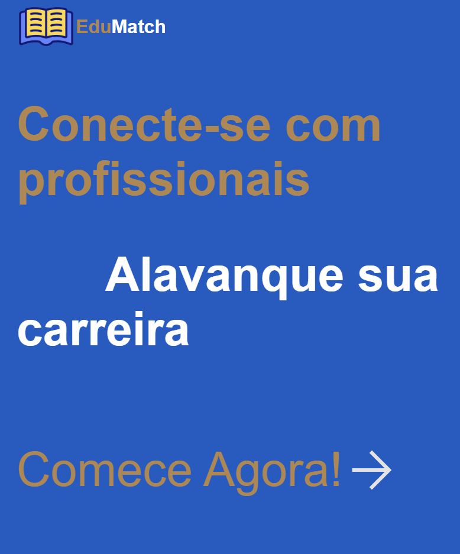
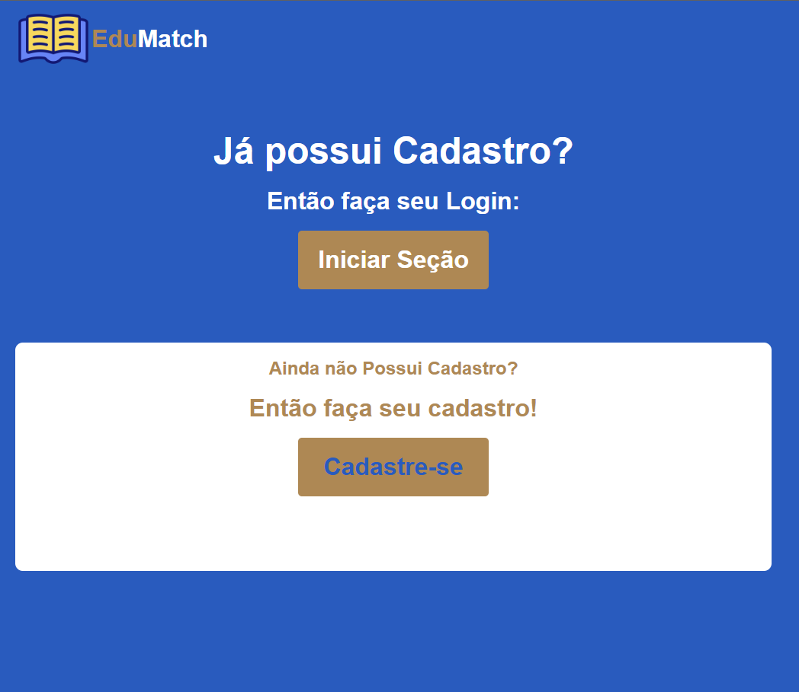
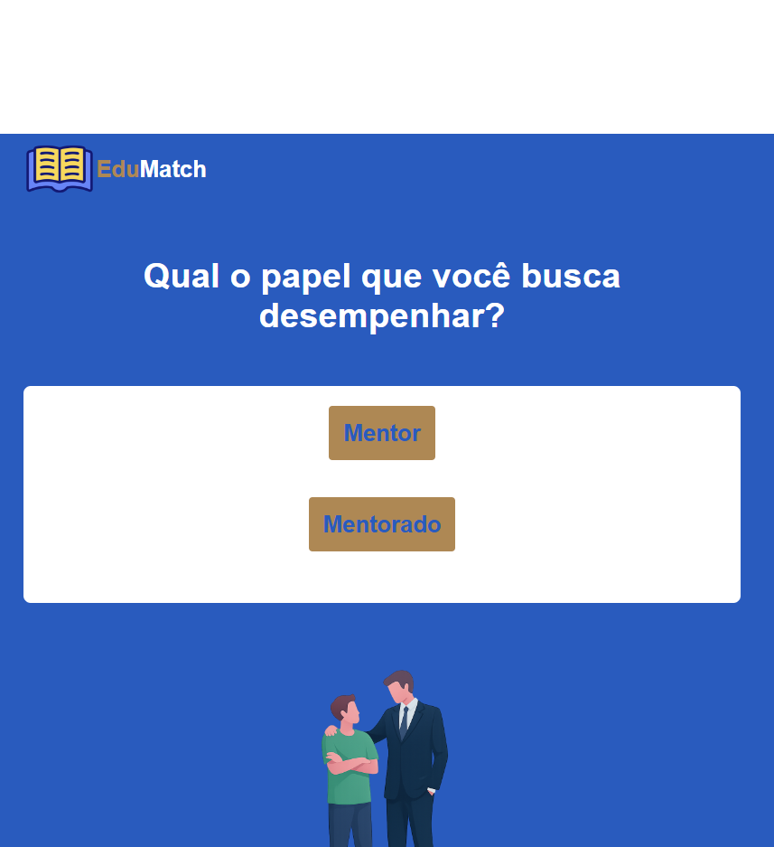
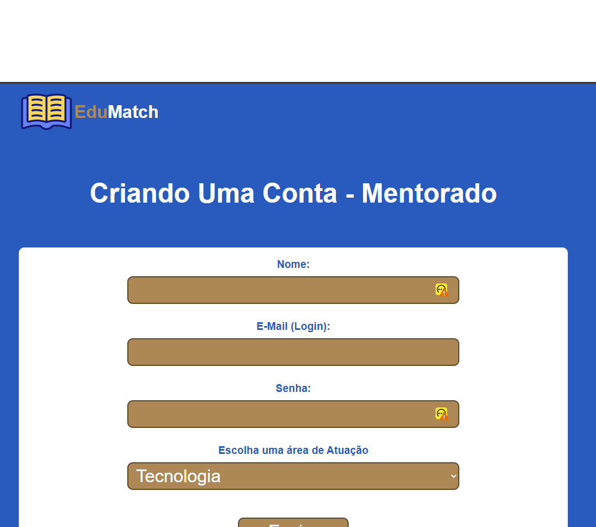
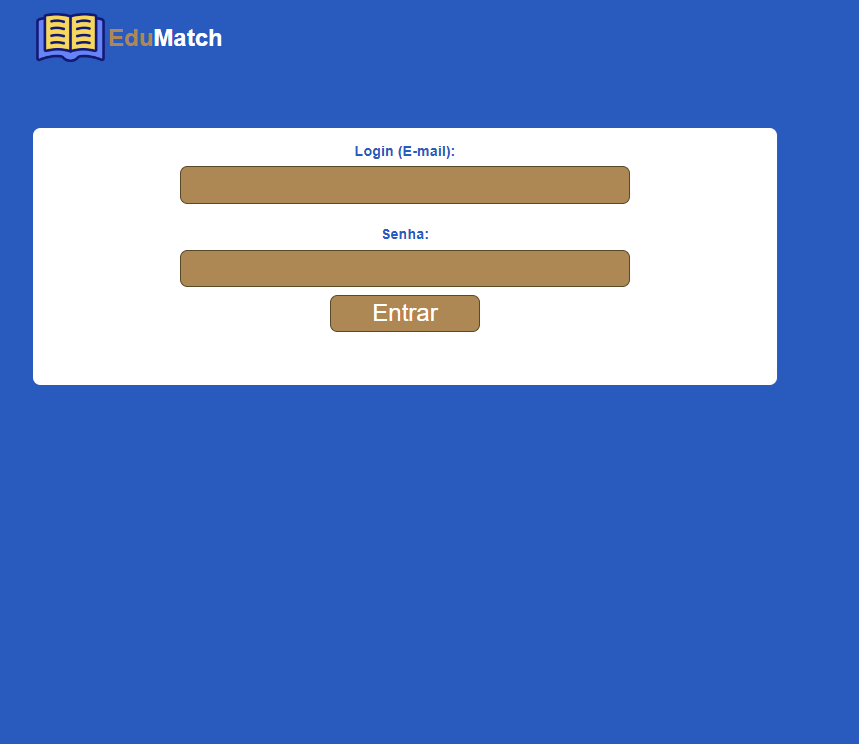
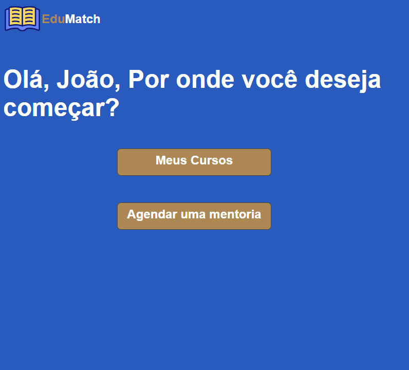
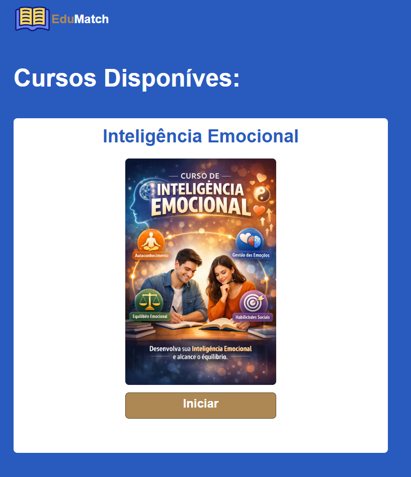

# Projeto Integrador (PI) - EduMatch

## Centro Universitário Senac

## Integrantes

**Carlos Eduardo Fagundes Saleme**  
**Erick Leite Freire** 
**Felipe Matos Oliveira** 
**Lucas Washington Menezes Guiron** 
**Mateus Nascimento Nogueira** 
**Sidney Alexandre Ribeiro Da Cruz** 
**Vitoria Pereira De Souza Cosmo Silva**  

## Documentação do Projeto

## Introdução

**A inserção de jovens no mercado de trabalho configura-se como um desafio recorrente para empresas e instituições educacionais. Embora estudantes e recém-formados apresentem sólida formação técnica, constata-se a existência de uma lacuna significativa no desenvolvimento de competências comportamentais — denominadas soft skills — tais como comunicação eficaz, inteligência emocional e etiqueta corporativa. Tal deficiência impacta diretamente a adaptação ao ambiente profissional e contribui para índices elevados de rotatividade entre jovens em primeiro emprego.**
**De acordo com Martins (2017), as soft skills não são ensinadas no ensino básico; tratam-se de habilidades e atitudes comportamentais inatas que podem ser aperfeiçoadas por cada indivíduo.**
**Nesse contexto, apresenta-se o Edu Match, solução digital voltada ao desenvolvimento de carreira de jovens aprendizes entre 16 e 22 anos. O aplicativo propõe uma abordagem inovadora ao estabelecer a conexão entre estudantes e profissionais experientes dispostos a atuar como mentores, promovendo um espaço de aprendizado colaborativo e acessível. A plataforma, desenvolvida em ambiente web para utilização em laboratórios escolares e corporativos, disponibiliza trilhas de aprendizado em micro vídeos, sistema de match entre mentor e mentorado por área de interesse e fórum de dúvidas em tempo real.**
**Silva Junior (2025) defende que, para a constituição de um ambiente de trabalho positivo, com indivíduos engajados com a organização, faz-se necessário que os trabalhadores disponham de segurança psicológica, estímulo ao diálogo aberto, condições equilibradas para o exercício profissional, ambiente favorável à resolução de conflitos e feedbacks construtivos. Ressalta-se que todas essas habilidades são desenvolvidas por meio das soft skills.**
**A justificativa para a criação do Edu Match fundamenta-se na necessidade de reduzir a rotatividade de jovens profissionais, decorrente majoritariamente da falta de preparo comportamental, e não técnico. Ao investir em competências socioemocionais e relacionais, objetiva-se não apenas apoiar a permanência desses jovens no mercado, mas também contribuir para a construção de trajetórias profissionais mais sólidas e sustentáveis.**

## 2. Visão Geral do Produto

**Aplicativo: "Edu Match" (orientação em soft skills para jovens aprendizes).
Uma solução voltada ao desenvolvimento de carreira para quem está entrando no mercado de trabalho.**

**Problema: Jovens em seu primeiro emprego possuem base técnica, mas sentem enorme dificuldade em comunicação, inteligência emocional e etiqueta corporativa.**
**Público-alvo: Estudantes de 16 a 22 anos e profissionais experientes dispostos a serem mentores.**
**Justificativa: O alto índice de rotatividade de jovens no mercado é causado, em grande parte, por falta de adaptação comportamental, não técnica.**
**Tipo de solução: Web (foco em acessibilidade em laboratórios de escolas e empresas).**
**Funcionalidades principais: Trilhas de aprendizado em micro vídeos, sistema de "match" entre mentor e mentorado por área de interesse e fórum de dúvidas em tempo real.**

## 3. Partes Interessadas (Stakeholders)

**As partes interessadas, também chamadas de stakeholders, são indivíduos, grupos ou organizações que podem influenciar ou ser impactados pelo desenvolvimento de um projeto. No contexto do aplicativo Edu Match, diferentes atores participam direta ou indiretamente do desenvolvimento e da utilização da plataforma, possuindo interesses específicos relacionados à solução proposta.**

## Jovens Aprendizes

**Os jovens aprendizes representam o principal público-alvo do aplicativo. Esse grupo é formado por estudantes e jovens entre 16 e 22 anos que estão ingressando no mercado de trabalho. A plataforma busca auxiliá-los no desenvolvimento de habilidades comportamentais, como comunicação, inteligência emocional e postura profissional.**

## Mentores

**Os mentores são profissionais experientes que participam da plataforma oferecendo orientação e compartilhando experiências profissionais com os jovens aprendizes. Sua participação contribui para o desenvolvimento das competências comportamentais e para a preparação dos usuários para o ambiente corporativo.**

## Instituições de Ensino

**As instituições de ensino, como escolas e cursos profissionalizantes, podem atuar como parceiras do projeto ao incentivar o uso da plataforma entre os estudantes. Dessa forma, contribuem para complementar a formação acadêmica com o desenvolvimento de habilidades voltadas ao mercado de trabalho.**

## Empresas

**Empresas e departamentos de recursos humanos também são stakeholders importantes, pois podem incentivar o uso da plataforma por jovens profissionais. O uso do Edu Match pode contribuir para melhorar a adaptação desses profissionais ao ambiente corporativo e reduzir a rotatividade.**

## Equipe de Desenvolvimento

**A equipe de desenvolvimento é responsável pela criação, implementação e manutenção do sistema. Esse grupo garante o funcionamento adequado da plataforma e a implementação das funcionalidades, como trilhas de aprendizado, sistema de conexão entre mentor e mentorado e fórum de dúvidas.**
**Os gestores do projeto são responsáveis pelo planejamento e pelas tomadas de decisões estratégicas relacionadas ao desenvolvimento do Edu Match, garantindo a viabilidade e o crescimento da plataforma.**

## Personas

## Persona 1

**Nome: Lucas Andrade.**
**Idade: 18 anos.**
**Profissão: Jovem Aprendiz Administrativo.**
**Perfil Comportamental: Lucas é curioso e motivado para crescer profissionalmente. Ele aprende rápido em tarefas técnicas, mas se sente inseguro em situações de comunicação com superiores ou reuniões de equipe. Prefere conteúdos rápidos e práticos, principalmente em vídeo.**

**Objetivos:**

**● Aprender a se comunicar melhor no ambiente corporativo.**
**● Desenvolver inteligência emocional no trabalho.**
**● Entender como se comportar em reuniões e interações profissionais.**
**● Crescer na empresa e conquistar uma efetivação.**

**Necessidades:**

**● Conteúdo simples e direto sobre comportamento profissional.**
**● Orientação prática sobre comunicação e postura no trabalho.**
**● Acesso a mentores que já tenham experiência no mercado.**
**● Espaço para tirar dúvidas sobre situações reais do trabalho.**

**Dores (Problemas Enfrentados):**

**● Medo de falar em reuniões ou apresentações.**
**● Dificuldade em lidar com críticas ou pressão.**
**● Não saber como agir em situações formais do trabalho.**
**● Falta de alguém para orientar sobre carreira no início profissional.**

**Nível de Familiaridade com Tecnologia:**

**Alto — usa celular, redes sociais, vídeos online e plataformas digitais diariamente, mas prefere interfaces simples e intuitivas.**

## 4.2 Persona 2 — Mentor Profissional

**Nome: Mariana Costa.**
**Idade: 34 anos.**
**Profissão: Analista de Recursos Humanos Sênior.**
**Perfil Comportamental: Mariana gosta de compartilhar conhecimento e ajudar jovens profissionais a se **desenvolverem. É organizada, comunicativa e acredita que orientação comportamental é essencial para o **crescimento profissional.**

**Objetivos:**

**● Ajudar jovens a se adaptarem ao ambiente corporativo.**
**● Compartilhar experiências profissionais.**
**● Contribuir para a formação de novos talentos.**
**● Desenvolver habilidades de liderança e mentoria.**

**Necessidades:**

**● Plataforma simples para se conectar com jovens aprendizes.**
**● Ferramentas para responder dúvidas e orientar mentorados.**
**● Conteúdos estruturados para apoiar o processo de mentoria.**
**● Sistema que conecte mentor e aprendiz por área de interesse.**

**Dores (Problemas Enfrentados):**

**● Falta de tempo para realizar mentorias presenciais.**
**● Dificuldade em encontrar jovens interessados em orientação.**
**● Falta de estrutura ou plataforma organizada para mentoria.**
**● Dificuldade em acompanhar a evolução dos mentorados.**

**Nível de Familiaridade com Tecnologia:**

**Médio a alto — utiliza plataformas digitais no trabalho, ferramentas de comunicação online e ambientes corporativos digitais.**
**Figura 1 - Personas**

**Fonte: Elaborado pelos autores**

## 4.3 Persona 3 — Coordenador Educacional

**Nome: Rafael Mendes.**
**Idade: 42 anos.**
**Profissão: Coordenador de Curso Técnico.**
**Perfil Comportamental: Rafael é focado em resultados educacionais e na empregabilidade dos alunos. Ele se preocupa não apenas com a formação técnica, mas com a preparação completa para o mercado. Busca soluções práticas que possam ser implementadas facilmente na rotina da instituição.**

**Objetivos:**
**● Aumentar a taxa de empregabilidade dos alunos.**
**● Preparar estudantes para o comportamento profissional.**
**● Reduzir problemas de adaptação no primeiro emprego.**
**● Implementar ferramentas inovadoras na instituição.**

**Necessidades:**

**● Plataforma acessível em laboratório de informática.**
**● Conteúdo estruturado e alinhado ao mercado.**
**● Ferramentas que complementam o ensino técnico.**
**● Relatórios de desempenho dos alunos.**

**Dores (Problemas Enfrentados):**

**● Alunos tecnicamente bons, mas despreparados de forma comportamental.**
**● Falta de ferramentas práticas para ensinar soft skills.**
**● Dificuldade em acompanhar evolução individual dos alunos.**
**● Baixo engajamento em conteúdos teóricos tradicionais.**

**Nível de Familiaridade com Tecnologia:**

**Médio — utiliza sistemas educacionais, plataformas EAD (ensino a distância) e ferramentas administrativas.**

## 4.4 Persona 4 — Gestora de RH

**Nome: Juliana Ribeiro.**
**Idade: 37 anos.**
**Profissão: Gerente de Recursos Humanos.**
**Perfil Comportamental: Juliana é estratégica e orientada a resultados. Está sempre buscando soluções que **reduzam custos com turnover e aumentem a retenção de talentos. Valoriza ferramentas que tragam métricas **claras e impacto real no comportamento dos colaboradores.**

**Objetivos:**

**● Reduzir a rotatividade de jovens aprendizes.**
**● Melhorar o comportamento profissional da equipe.**
**● Acelerar o processo de adaptação de novos colaboradores.**
**● Desenvolver futuros talentos dentro da empresa.**

**Necessidades:**

**● Plataforma fácil de implementar na empresa.**
**● Indicadores de desempenho e evolução comportamental.**
**● Conteúdos aplicáveis ao ambiente corporativo.**
**● Integração com programas de jovem aprendiz.**

**Dores (Problemas Enfrentados):**

**● Alta rotatividade de jovens por questões comportamentais.**
**● Falta de preparo em comunicação e postura profissional.**
**● Tempo e custo elevado com treinamentos internos.**
**● Dificuldade em mensurar desenvolvimento comportamental.**

**Nível de Familiaridade com Tecnologia:**

**Alto — utiliza sistemas de gestão de pessoas, dashboards e ferramentas corporativas.**

**Figura 2 - Personas**
**Fonte: Elaborado pelos autores**

## 5. Jornada do Usuário

**A jornada do usuário simula situações reais de uso com base nas personas definidas para o Edu Match. Cada persona percorre um caminho diferente na plataforma, de acordo com seus objetivos, necessidades e contexto de uso.**

## 5.1 Persona 1 — Lucas Andrade (Jovem Aprendiz)

**Lucas tem 18 anos e está no seu primeiro emprego como aprendiz administrativo. Ele domina bem as tarefas técnicas do dia a dia, mas sente insegurança na hora de se comunicar com superiores ou participar de reuniões. Ao conhecer o Edu Match por indicação de um colega, enxerga na plataforma uma forma de se desenvolver sem precisar expor suas dificuldades em público.**

**Jornada:**

**1. Lucas acessa a plataforma Edu Match pelo computador ou celular.**
**2. Realiza seu cadastro informando dados básicos e área de interesse.**
**3. Após entrar, visualiza as trilhas de aprendizado disponíveis.**
**4. Escolhe a trilha de comunicação no trabalho e começa pelo primeiro módulo.**
**5. Assiste aos micros vídeos no intervalo do almoço, em sessões curtas de 5 a 10 minutos.**
**6. Realiza o acesso ao fórum para tirar uma dúvida sobre como se portar em reuniões com gestores.**
**7. O sistema sugere mentores com base no seu perfil — Mariana, da área de RH, é indicada.**
**8. Lucas escolhe Mariana como mentora e inicia uma conversa pelo chat da plataforma.**
**9. Recebe orientações práticas sobre situações reais do trabalho.**
**10. Conclui a trilha, aplica o que aprendeu no dia a dia e acompanha sua evolução no painel de progresso.**

**5.2 Persona 2 — Mariana Costa (Mentora)**

**Mariana tem 34 anos, trabalha como analista sênior de RH e gosta de contribuir com a formação de novos profissionais. Ela não tem tempo para mentorias presenciais frequentes, mas ao conhecer o Edu Match, vê uma oportunidade de ajudar jovens de forma organizada e no seu próprio ritmo.**

**Jornada:**

**1. Mariana acessa a plataforma e realiza o cadastro como mentora.**
**2. Configura seu perfil informando área de atuação, anos de experiência e disponibilidade.**
**3. Visualiza as solicitações de mentoria recebidas com o perfil resumido de cada aprendiz.**
**4. Aceita a conexão com Lucas, identificando compatibilidade de área e objetivos.**
**5. Acompanha o histórico de dúvidas de Lucas no fórum para entender melhor suas dificuldades.**
**6. Responde perguntas pelo chat e indica trilhas de conteúdo alinhadas ao que ele precisa.**
**7. Monitora a evolução de Lucas pelo painel de mentoria e envia um retorno ao final do ciclo.**

## 8. Considerações Finais

**O desenvolvimento do Edu Match evidencia a relevância de soluções digitais voltadas ao fortalecimento das soft skills em jovens aprendizes que ingressam no mercado de trabalho. A análise realizada ao longo do projeto demonstra que, embora a formação técnica seja consistente, a ausência de competências comportamentais — como comunicação, inteligência emocional e postura profissional — compromete a adaptação desses jovens ao ambiente corporativo e contribui para elevados índices de rotatividade.**
**A proposta do aplicativo apresenta-se como inovadora ao integrar trilhas de aprendizado em micro vídeos, sistema de conexão entre mentor e mentorado e fórum de dúvidas em tempo real, criando um ecossistema de aprendizagem colaborativa e acessível. Ademais, o envolvimento de diferentes stakeholders — jovens aprendizes, mentores, instituições de ensino, empresas e equipe de desenvolvimento — reforça o caráter abrangente e sustentável da iniciativa.**
**Constata-se que o Edu Match não apenas contribui para a redução da rotatividade juvenil, mas também promove o desenvolvimento de carreiras mais sólidas e alinhadas às demandas contemporâneas do mercado de trabalho. Ao investir em competências socioemocionais e relacionais, a plataforma fortalece a empregabilidade, amplia a retenção de talentos e fomenta a construção de trajetórias profissionais equilibradas e duradouras.**
**Em síntese, o projeto consolida-se como uma ferramenta estratégica para a formação integral de jovens profissionais, representando um avanço significativo na integração entre educação, tecnologia e mercado de trabalho.**

## 7. REFERÊNCIAS

**MARTINS, José Carlos Cordeiro. Soft Skills: Conheça as ferramentas para você adquirir, consolidar e compartilhar conhecimentos. São Paulo: Brasport, 2017.**

**SILVA JUNIOR. Wantuir Felippe da. Equipes de alto desempenho: Os 40 fatores da cultura corporativa que afetam as tensões emocionais, competências comportamentais (soft skills) e resultados empresariais. São Paulo: Dialética Literária, 2025.**
